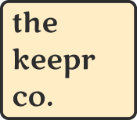

<!-- PROJECT LOGO -->

  
  

   
    Keepr provides a social networking platform for sharing and discovering interests through captivating images and videos called Keeps. Users can organize them in personal Vaults with the choice of keeping them private or public.
  

  
  

  <b>
    <a href="https://www.jaredcarlson.dev/keepr" target="_blank">Live Demo</a>
  </b>
  

<!-- ABOUT THE PROJECT -->
<!-- ## About -->

<!-- [![Contributors][contributors-shield]][contributors-url]
[![Forks][forks-shield]][forks-url]
[![Stargazers][stars-shield]][stars-url] -->
<!-- [![MIT License][license-shield]][license-url] -->

[![Product Name Screen Shot][product-screenshot]](https://www.jaredcarlson.dev/keepr)

## Technology Stack

[![Vue][Vue.js]][Vue-url] [![HTML5][HTML5]][HTML5-url] [![CSS3][CSS3]][CSS3-url] [![Bootstrap][Bootstrap]][Bootstrap-url] [![JavaScript][JavaScript]][JavaScript-url] [![ASP.NET][ASP.NET]][ASP.NET-url] [![MySQL][MySQL]][MySQL-url]

This project began with a standard **Boise CodeWorks starter template** (basic structure for .NET + Vue full-stack projects). From that foundation, I independently developed Keepr over one week as my **final exam project**.  

Keepr demonstrates my ability to take an architected design (with required models and endpoints) and deliver a fully functional, secure full-stack system independently.

Highlights:

- Implemented **C# ASP.NET WebAPI** with Repository pattern and Dapper ORM  
- Built all **CRUD operations** for Keeps, Vaults, and VaultKeeps (many-to-many relationship)  
- Added **Auth0 authentication & authorization** and enforced access control rules (private vaults, ownership checks)  
- Implemented API endpoints to support tracking of views, saves, and user activity  
- Adhered to provided **Figma UI mock** while extending functionality where appropriate  
- Passed complete **REST API testing suite** and met every application requirement

<!-- CONTACT -->
## Contact

Jared Carlson
Portfolio: <a href="https://www.jaredcarlson.dev" target="_blank">www.jaredcarlson.dev</a>  
LinkedIn: <a href="https://linkedin.com/in/jaredrcarlson" target="_blank">jaredrcarlson</a>  
Email: <a href="mailto:jared@jaredcarlson.dev">jared@jaredcarlson.dev</a>  

<!-- LICENSE -->
## License

Distributed under the MIT License. See `LICENSE.txt` for more information.

<!-- MARKDOWN LINKS & IMAGES -->
<!-- https://www.markdownguide.org/basic-syntax/#reference-style-links -->
[product-screenshot]: images/keepr_screenshot.png

[HTML5]: https://img.shields.io/badge/HTML5-252526?style=for-the-badge&logo=html5
[HTML5-url]: https://developer.mozilla.org/en-US/docs/Glossary/HTML5
[CSS3]: https://img.shields.io/badge/CSS3-252526?style=for-the-badge&logo=css3&logoColor=1572B6
[CSS3-url]: https://developer.mozilla.org/en-US/docs/Web/CSS
[Bootstrap]: https://img.shields.io/badge/Bootstrap-252526?style=for-the-badge&logo=bootstrap
[Bootstrap-url]: https://getbootstrap.com
[JavaScript]: https://img.shields.io/badge/JavaScript-252526?style=for-the-badge&logo=javascript
[JavaScript-url]: https://www.javascript.com/
[Vue.js]: https://img.shields.io/badge/Vue.js-252526?style=for-the-badge&logo=vuedotjs
[Vue-url]: https://vuejs.org/
[ASP.NET]: https://img.shields.io/badge/.NET-252526?style=for-the-badge&logo=dotnet
[ASP.NET-url]: https://dotnet.microsoft.com/en-us/apps/aspnet
[MySQL]: https://img.shields.io/badge/MySQL-252526?style=for-the-badge&logo=mysql
[MySQL-url]: https://www.mysql.com/